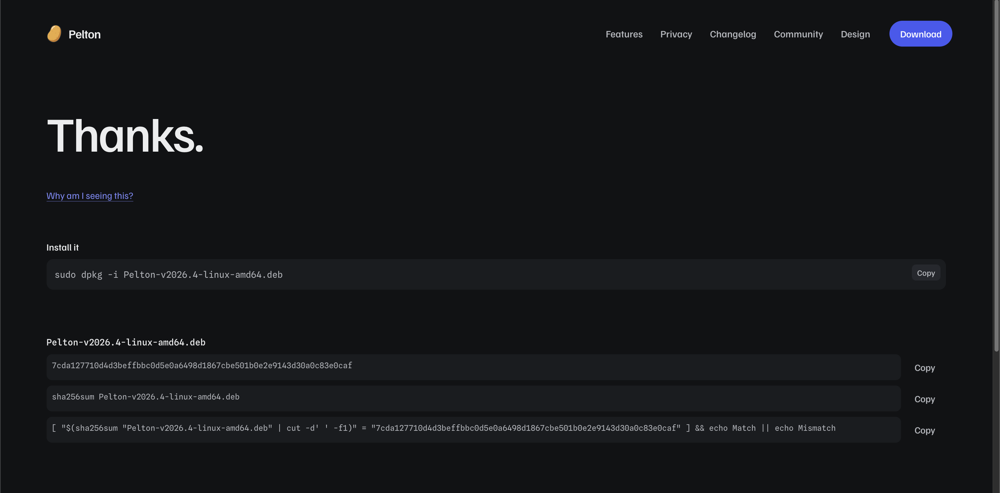
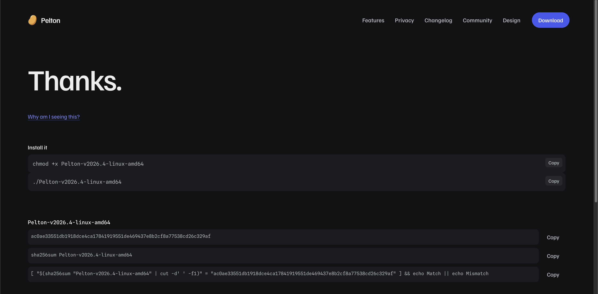

# Linux

- [Fedora](#fedora)
- [Debian / Ubuntu (.deb)](#debian-ubuntu-deb)
- [Arch (AUR)](#arch-aur)
- [Generic RPM](#generic-rpm)
- [Generic binary](#generic-binary)
- [Nix](#nix)

??? question "Which one do I need?"
    - Running Fedora? Use [Fedora](#fedora) (Copr), it keeps Pelton updated through `dnf`.
    - Running Debian, Ubuntu, or a derivative? Use [Debian / Ubuntu (.deb)](#debian-ubuntu-deb).
    - Running Arch or a derivative? Use [Arch (AUR)](#arch-aur).
    - On an RPM-based distro that isn't Fedora? Use [Generic RPM](#generic-rpm).
    - Use [Nix](#nix) if you manage your system (or just your packages) with Nix.
    - Anything else, or you'd rather not install system-wide? Use the [Generic binary](#generic-binary).

## Fedora

### Checklist
<div class="checklist" markdown>
- [ ] Enable the Copr repo
- [ ] Install Pelton
- [ ] Go through onboarding
- [ ] [Add your first mailbox](../mailbox/index.md)
</div>

### Installation

Pelton is packaged for Fedora through [Copr](https://copr.fedorainfracloud.org/),
Fedora's community repo host. Enabling it adds Pelton's repo to `dnf`, so future
releases show up as normal updates.

```bash
sudo dnf copr enable arnek/Pelton
sudo dnf install pelton
```

- [x] Enable the Copr repo
- [x] Install Pelton

Pelton will now start. Go through the Onboarding wizard. To add your first mailbox, see [Setting up a mailbox](../mailbox/index.md).

## Debian / Ubuntu (.deb)

### Checklist
<div class="checklist" markdown>
- [ ] Download the `.deb`
- [ ] Verify SHA-256 Checksum
- [ ] Install the `.deb`
- [ ] Go through onboarding
- [ ] [Add your first mailbox](../mailbox/index.md)
</div>

### Installation

#### 1. Download

Download the `.deb` from
[pelton.app/download](https://pelton.app/download)
or from
[GitHub Releases](https://github.com/peltonapp/Pelton/releases/latest)

- [x] Download the `.deb`

!!! tip "Verify Checksum"
    It's **highly recommended** to verify the Checksum (SHA-256 hash) of the file you've downloaded.

    The download page gives you a ready-to-run verify command next to the install command:

    

    Open your Terminal and navigate to your downloads folder (`cd ~/Downloads`), then run the
    `sha256sum ... && echo Match || echo Mismatch` command from the page.

    If it says `Match` then you can **proceed** with the installation and everything is fine.

    If it says `Mismatch` then the file got corrupted or was tampered with. **Do not proceed.** You can try repeating the download.

    - [x] Verify SHA-256 Checksum

#### 2. Install

```bash
sudo dpkg -i Pelton-<VERSION>-linux-amd64.deb
```

- [x] Install the `.deb`

Pelton will now start. Go through the Onboarding wizard. To add your first mailbox, see [Setting up a mailbox](../mailbox/index.md).

## Arch (AUR)

### Checklist
<div class="checklist" markdown>
- [ ] Install from the AUR
- [ ] Go through onboarding
- [ ] [Add your first mailbox](../mailbox/index.md)
</div>

### Installation

Pelton is available on the [AUR](https://aur.archlinux.org/packages/pelton-bin)
as `pelton-bin`, thanks to [leeteral (AUR Maintainer)](https://leeism.com)
([GitHub](https://github.com/leeteral)). Install it with your AUR helper of choice:

```bash
yay -S pelton-bin
```

`pelton-bin` is maintained separately from Pelton's own release pipeline, so
it can lag behind a brand new release while the package gets bumped, usually
by just a few hours. You can check its current status on
[Repology](https://repology.org/project/pelton/versions), which tracks
Pelton's packaging across distros and package managers.

- [x] Install from the AUR

Pelton will now start. Go through the Onboarding wizard. To add your first mailbox, see [Setting up a mailbox](../mailbox/index.md).

## Generic RPM

### Checklist
<div class="checklist" markdown>
- [ ] Download the `.rpm`
- [ ] Verify SHA-256 Checksum
- [ ] Install the `.rpm`
- [ ] Go through onboarding
- [ ] [Add your first mailbox](../mailbox/index.md)
</div>

### Installation

If you're not on Fedora but still want a native RPM install (or don't want to add the Copr
repo), you can install the `.rpm` directly.

#### 1. Download

Download the `.rpm` from
[pelton.app/download](https://pelton.app/download)
or from
[GitHub Releases](https://github.com/peltonapp/Pelton/releases/latest)

- [x] Download the `.rpm`

!!! tip "Verify Checksum"
    It's **highly recommended** to verify the Checksum (SHA-256 hash) of the file you've downloaded.

    The download page gives you a ready-to-run verify command next to the install command:

    

    Open your Terminal and navigate to your downloads folder (`cd ~/Downloads`), then run the
    `sha256sum ... && echo Match || echo Mismatch` command from the page.

    If it says `Match` then you can **proceed** with the installation and everything is fine.

    If it says `Mismatch` then the file got corrupted or was tampered with. **Do not proceed.** You can try repeating the download.

    - [x] Verify SHA-256 Checksum

#### 2. Install

```bash
sudo rpm -i Pelton-<VERSION>-linux-fedora-x86_64.rpm
```

- [x] Install the `.rpm`

Pelton will now start. Go through the Onboarding wizard. To add your first mailbox, see [Setting up a mailbox](../mailbox/index.md).

## Generic binary

### Checklist
<div class="checklist" markdown>
- [ ] Download the binary
- [ ] Verify SHA-256 Checksum
- [ ] Make it executable and run it
- [ ] Go through onboarding
- [ ] [Add your first mailbox](../mailbox/index.md)
</div>

### Installation

No package manager, no `sudo`: just a raw binary. Useful on distros without `.deb`/`.rpm`
support, or if you'd rather run Pelton without installing it system-wide.

#### 1. Download

Download the binary from
[pelton.app/download](https://pelton.app/download)
or from
[GitHub Releases](https://github.com/peltonapp/Pelton/releases/latest)

- [x] Download the binary

!!! tip "Verify Checksum"
    It's **highly recommended** to verify the Checksum (SHA-256 hash) of the file you've downloaded.

    The download page gives you a ready-to-run verify command next to the run command:

    

    Open your Terminal and navigate to your downloads folder (`cd ~/Downloads`), then run the
    `sha256sum ... && echo Match || echo Mismatch` command from the page.

    If it says `Match` then you can **proceed** with the installation and everything is fine.

    If it says `Mismatch` then the file got corrupted or was tampered with. **Do not proceed.** You can try repeating the download.

    - [x] Verify SHA-256 Checksum

#### 2. Run it

```bash
chmod +x Pelton-<VERSION>-linux-amd64
./Pelton-<VERSION>-linux-amd64
```

- [x] Make it executable and run it

Pelton will now start. Go through the Onboarding wizard. To add your first mailbox, see [Setting up a mailbox](../mailbox/index.md).

## Nix

### Checklist
<div class="checklist" markdown>
- [ ] Run or install via the flake
- [ ] Go through onboarding
- [ ] [Add your first mailbox](../mailbox/index.md)
</div>

### Installation

Pelton ships a flake. Point it at a release tag, not the bare repo:

```bash
nix run github:peltonapp/Pelton/v2026.4
```

Or install it into your profile:

```bash
nix profile install github:peltonapp/Pelton/v2026.4
```

- [x] Run or install via the flake

!!! note
    Linux only for now.

Pelton will now start. Go through the Onboarding wizard. To add your first mailbox, see [Setting up a mailbox](../mailbox/index.md).

## Need help?

See [Support](../support.md).
