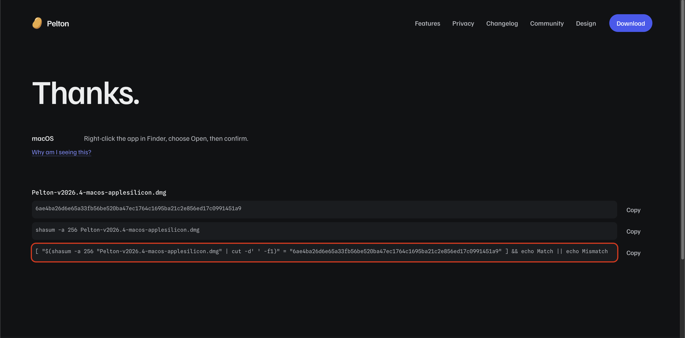
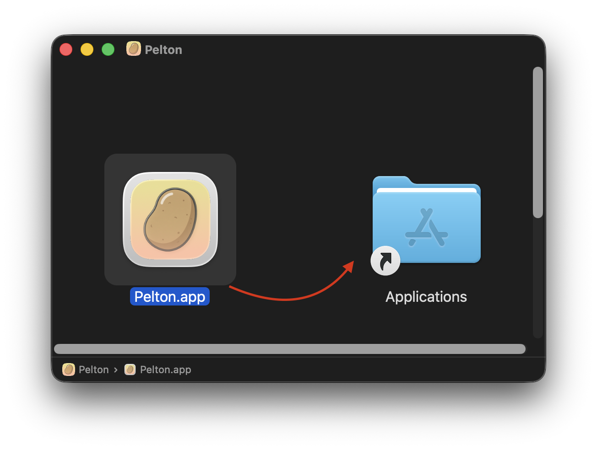
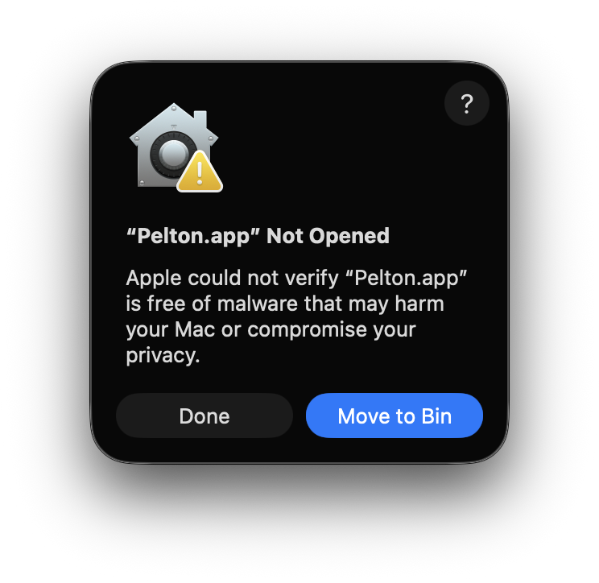
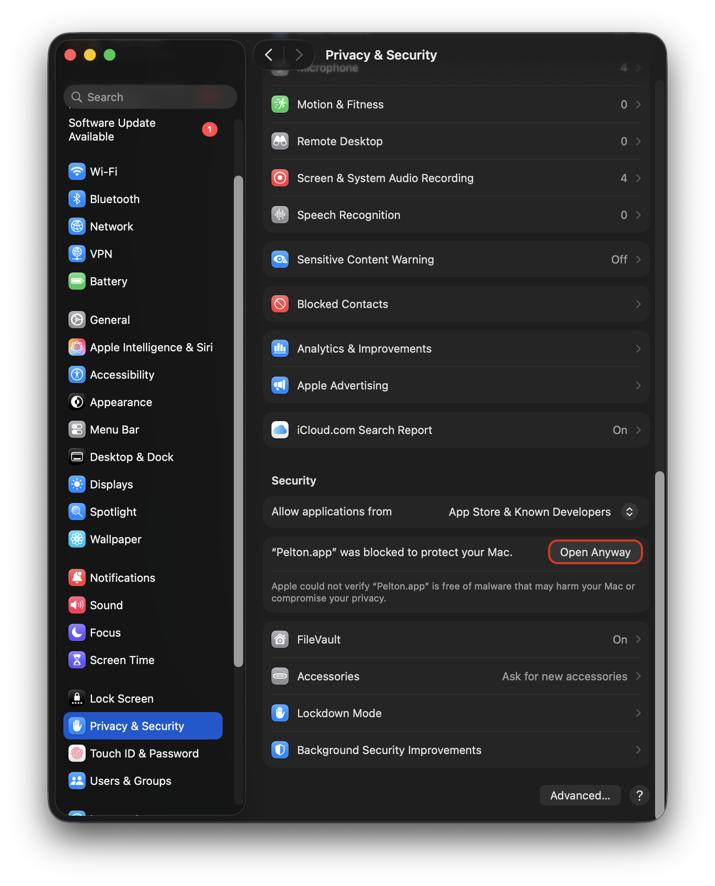
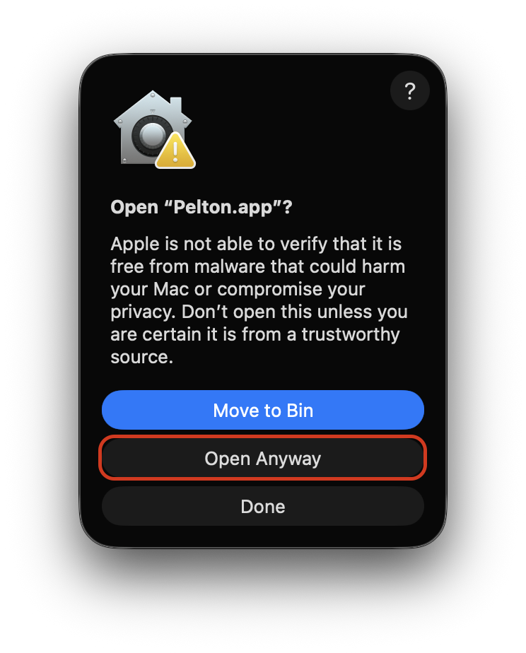

# macOS

## Checklist

- [ ] Download DMG
- [ ] Verify SHA-256 Checksum
- [ ] Install using DMG
- [ ] Allow in Settings (Gatekeeper)
- [ ] Go through onboarding
- [ ] [Add your first mailbox](../mailbox/index.md)

## Installation

### 1. Download

Download the installer from 
[pelton.app/download](https://pelton.app/download)
or from 
[GitHub Releases](https://github.com/peltonapp/Pelton/releases/latest)

- [x] Download DMG

??? info "Portable Installations and Package Managers (Homebrew)"
    Portable `.app`'s are not yet available but are in the works: 
    [#377](https://github.com/peltonapp/Pelton/issues/377).

    Until then, a workaround would be either:

    1. [Build Pelton from source](build-from-source.md)
    2. Install Pelton and grab the `.app` from the Applications directory.
    ---
    Installing using Homebrew is not yet supported.

!!! tip "Verify Checksum"
    It's **highly recommended** to verify the Checksum (SHA-256 hash) of the file you've downloaded.
    
    **What is a checksum verification?**

    Verifying the checksum means comparing a hash, 
    a short fingerprint calculated from the file's contents, 
    against the one Pelton publishes, 
    so you can confirm the download **wasn't corrupted or tampered** with in transit.
    
    **How to verify**

    When downloading from [pelton.app/download](https://pelton.app/download), you will get a command which will
    verify the checksums: 
    To run it, open your Terminal (++cmd+space++, type `terminal`, ++enter++) and navigate to
    your downloads folder using `cd ~/Downloads`. Then run the command from the website.
    
    If it says `Match` then you can **proceed** with the installation and everything is fine.
    
    If it says `Mismatch` then the file got corrupted or was tampered with. **Do not proceed.** You can try repeating the download,
    or [reach out for help](../support.md) if it keeps happening.
    
    - [x] Verify SHA-256 Checksum

### 2. Installing Pelton

Run the newly downloaded file. The filename should look something like this: `Pelton-<VERSION>-macos-<applesilicion/intel>.dmg`.
Double click it and drag the App into the Applications folder. 

- [x] Install using DMG

Then launch the App (Using ++cmd+space++ and typing `Pelton` or checking the App Library).
You will probably run into Gatekeeper not allowing you to run Pelton. It might look something like this:

{ width=350 }

???+ info "Why is macOS not allowing Pelton to run?"
    macOS only allows apps signed and notarized by Apple to open without a warning.
    Notarization requires an Apple Developer Program membership, which costs money every year.

    This is going to be fixed in the future, see [#97](https://github.com/peltonapp/Pelton/issues/97).

To allow Pelton to run, hit `Done`. Then launch `System Settings` and navigate to `Privacy & Security`.
Scroll down until you see Pelton and the `Open Anyway` button. Press it.

Then hit `Open Anyway` again. You may be asked to confirm with your password or Touch ID.

{ width=350 }

- [x] Allow in Settings (Gatekeeper)

Pelton will now start. Go through the Onboarding wizard. To add your first mailbox, see [Setting up a mailbox](../mailbox/index.md).

## Need help?

See [Support](../support.md).
