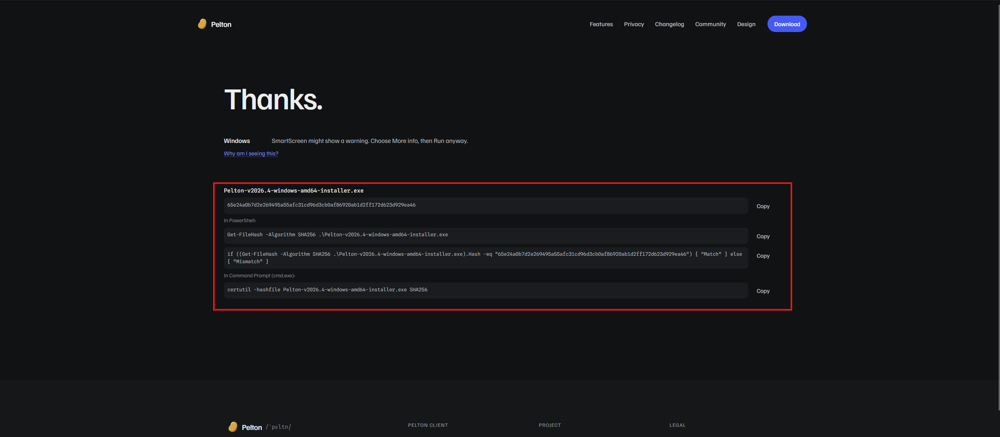
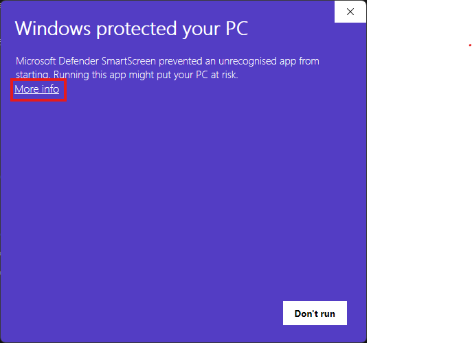
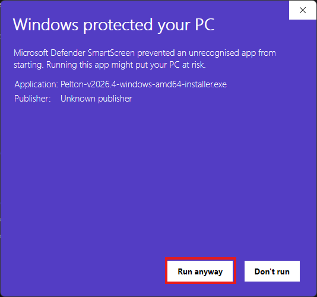

# Windows

## Checklist

- [ ] Download Installer
- [ ] Verify SHA-256 Checksum
- [ ] Run Installer
- [ ] Allow through SmartScreen
- [ ] Launch Pelton
- [ ] Go through onboarding
- [ ] [Add your first mailbox](../mailbox/index.md)

## Installation

### 1. Download
Download the installer from 
[pelton.app/download](https://pelton.app/download)
or from 
[GitHub Releases](https://github.com/peltonapp/Pelton/releases/latest)

- [x] Download Installer

??? info "Portable Installations and Package Managers (Winget/Chocolatey)"
    Every release also ships a portable build, named
    `Pelton-<VERSION>-windows-amd64-portable.exe`. It is the same executable the
    installer wraps, just on its own: Pelton is a single file, so the installer
    only adds the Start Menu and Desktop shortcuts and the entry in
    **Add or remove programs**.

    Put it wherever you like, a USB stick included, and run it. Nothing is
    installed and nothing is registered.

    !!! warning "Portable means the app, not your mail"
        Your mailboxes, messages and settings live in `%APPDATA%\Pelton`, in the
        Windows profile of whoever runs it, **not** next to the `.exe`. Carrying
        the file to another machine gives you Pelton there, not your mail, and
        deleting the file leaves that data behind. To remove it as well, delete
        `%APPDATA%\Pelton` too.

    To update a portable install, download the newer `.exe` and replace the old
    one. There is nothing to uninstall first, and your mail is untouched because
    it was never in that file.
    ---
    Pelton is not yet in the Chocolatey or Winget registry.
    However, this will be done in the future. See [#376](https://github.com/peltonapp/Pelton/issues/376)

!!! tip "Verify Checksum"
    It's **highly recommended** to verify the Checksum (SHA-256 hash) of the file you've downloaded.
    
    **What is a checksum verification?**

    Verifying the checksum means comparing a hash, 
    a short fingerprint calculated from the file's contents, 
    against the one Pelton publishes, 
    so you can confirm the download **wasn't corrupted or tampered** with in transit.
    
    **How to verify**

    When downloading from [pelton.app/download](https://pelton.app/download), you will get commands which will
    verify the checksum: 
    To run one, open PowerShell or Command Prompt, navigate to your downloads folder with
    `cd $env:USERPROFILE\Downloads` (PowerShell) or `cd %USERPROFILE%\Downloads` (Command Prompt), then run the
    command from the website.

    If it says `Match` then you can **proceed** with the installation and everything is fine.

    If it says `Mismatch` then the file got corrupted or was tampered with. **Do not proceed.** You can try repeating the download,
    or [reach out for help](../support.md) if it keeps happening.

    - [x] Verify SHA-256 Checksum

### 2. Installing Pelton

Run the downloaded file. The filename should look something like this: `Pelton-<VERSION>-windows-amd64-installer.exe`.

- [x] Run Installer

You will probably run into SmartScreen not allowing you to run Pelton. It might look something like this:

{ width=350 }

???+ info "Why is SmartScreen not allowing Pelton to run?"
    SmartScreen flags any app it doesn't yet recognize as coming from a trusted publisher. Code-signing
    certificates that satisfy SmartScreen cost money every year, and enough people need to run the app before
    SmartScreen starts trusting it automatically.

Click `More info`, then click `Run anyway`:

{ width=350 }

- [x] Allow through SmartScreen

Pelton will now start. Go through the Onboarding wizard. To add your first mailbox, see [Setting up a mailbox](../mailbox/index.md).

## Need help?

See [Support](../support.md).
