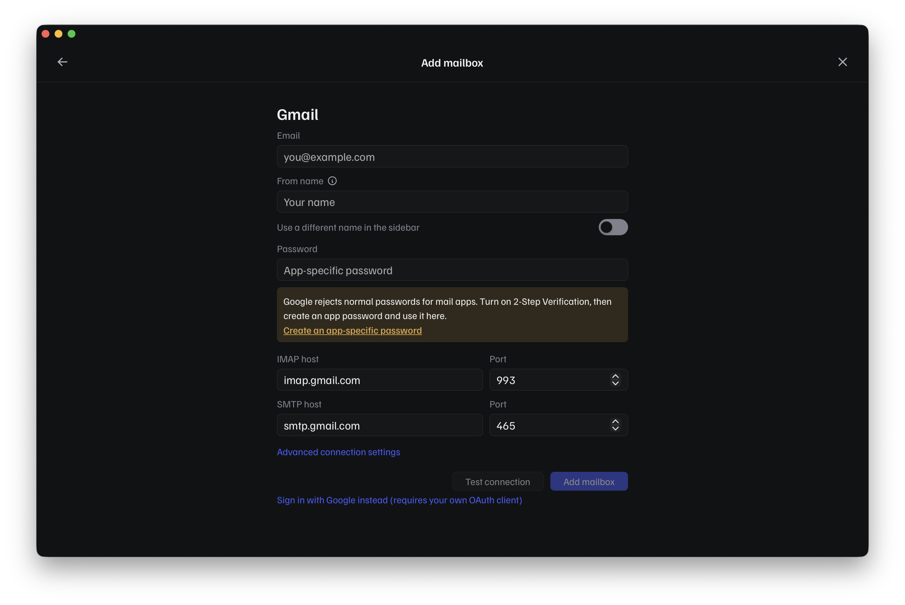
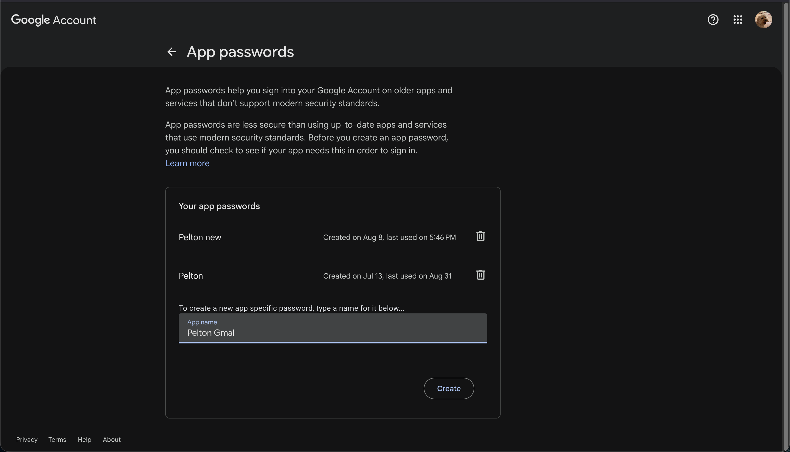
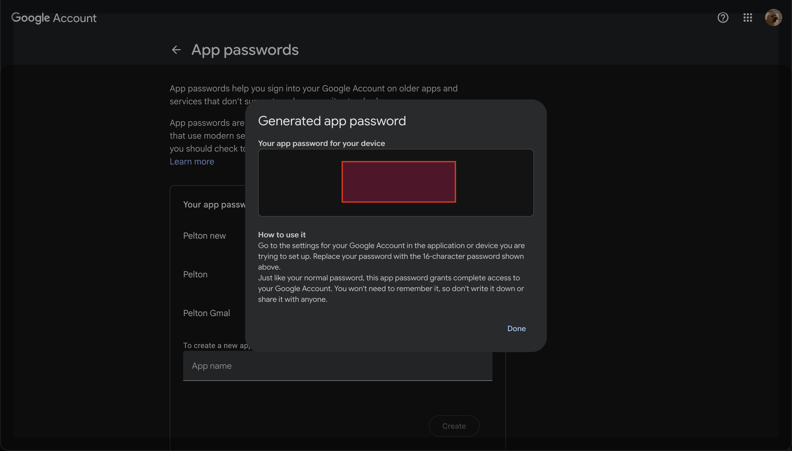

# Gmail

## Checklist

- [ ] Turn on 2-Step Verification
- [ ] Create an app-specific password
- [ ] Add the account in Pelton

!!! warning "2-Step Verification is required"
    Google only lets you create app-specific passwords once 2-Step
    Verification (2FA) is turned on for your account. If you haven't
    enabled it yet, go to your
    [Google Account security settings](https://myaccount.google.com/security)
    and turn on **2-Step Verification** first, you'll be asked to confirm
    sign-in with your phone or an authenticator app in addition to your
    password from then on.

!!! warning "You must use an app-specific password, not your Google password"
    Google rejects your normal account password for mail apps. Pelton's
    **Password** field needs an app-specific password instead, generated
    separately for Pelton.

- [x] Turn on 2-Step Verification

## Adding the account

1. Open **Add mailbox**, choose **Add a mailbox**, then pick **Gmail** from
   the provider list. Fill in your **Email** and **From name**. Pelton
   already knows Gmail's IMAP/SMTP hosts, so you won't need to touch those.

    

2. Click **Create an app-specific password** under the **Password** field.
   This opens
   [myaccount.google.com/apppasswords](https://myaccount.google.com/apppasswords).

3. On Google's **App passwords** page, type a name for it (for example
   "Pelton") and click **Create**.

    

4. Google shows you a 16-character password. Copy it, this is what goes in
   Pelton's **Password** field, not your normal Google password. You won't
   need to remember it yourself; Google won't show it to you again after
   you close this dialog.

    

5. Back in Pelton, paste the app password into the **Password** field,
   click **Test connection**, then **Add mailbox**.

- [x] Create an app-specific password
- [x] Add the account in Pelton

## About "Sign in with Google instead"

The Gmail form also has a **Sign in with Google instead** link for signing
in with OAuth 2.0 rather than an app password. It isn't recommended: Pelton
doesn't ship a Google-verified OAuth client, so using it means registering
your own OAuth client in Google Cloud Console yourself, which is more setup
for no real benefit over an app password for most people. Stick with the
app password flow above unless you specifically need OAuth.

## Need help?

See [Support](../support.md).
