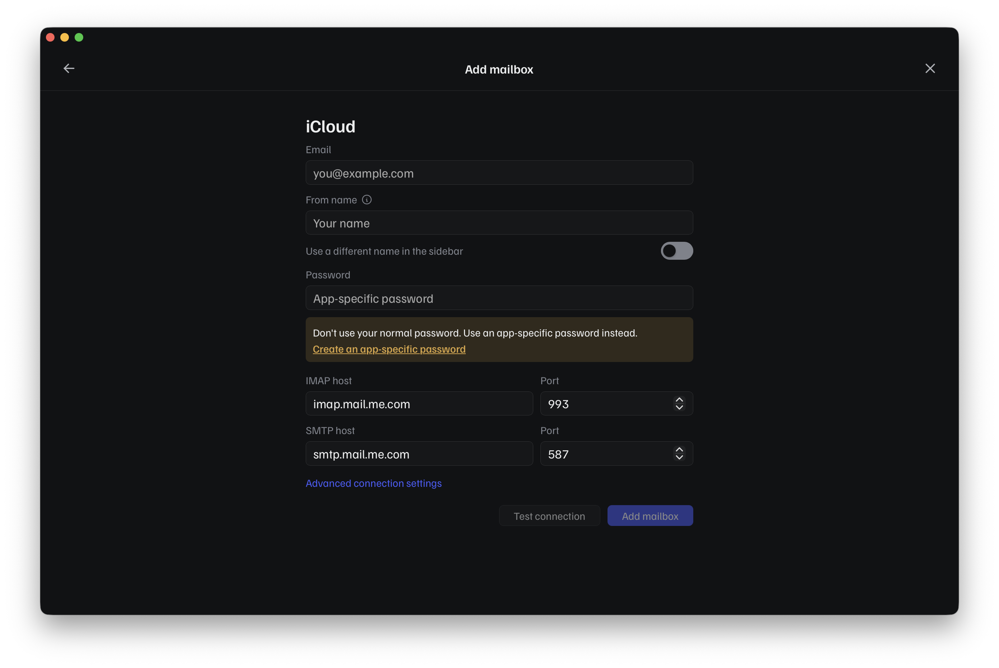
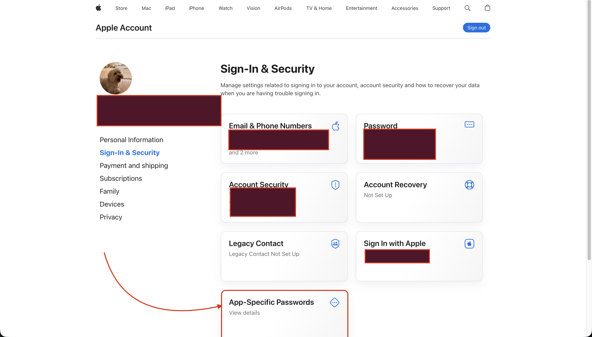
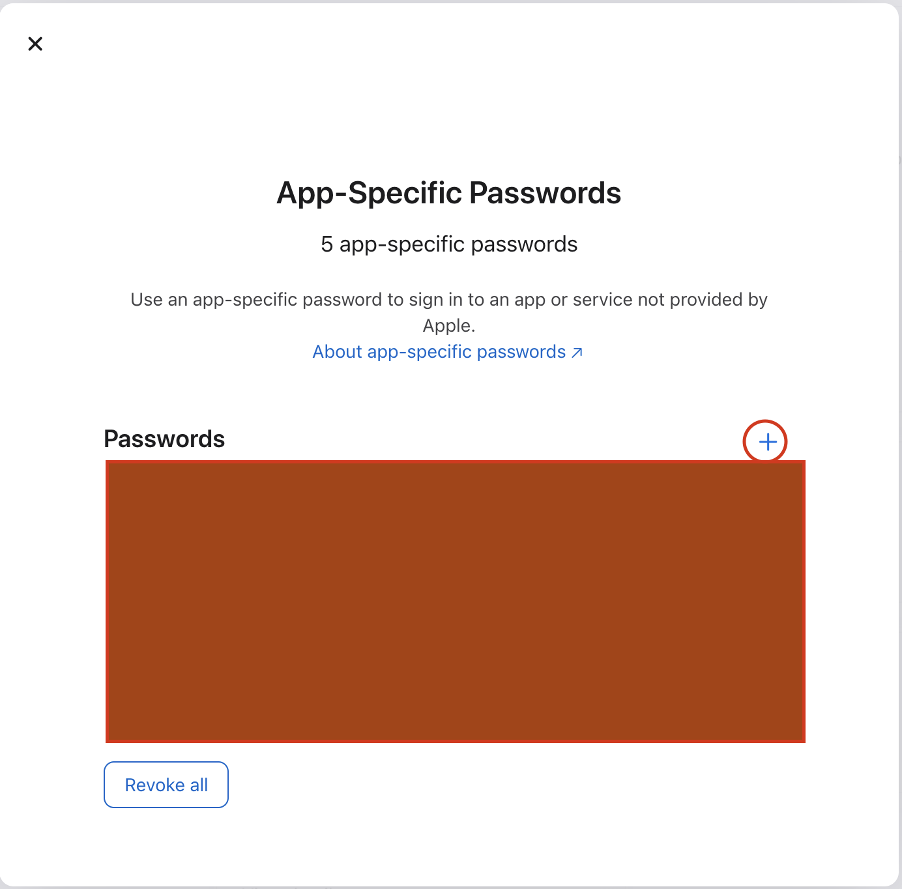
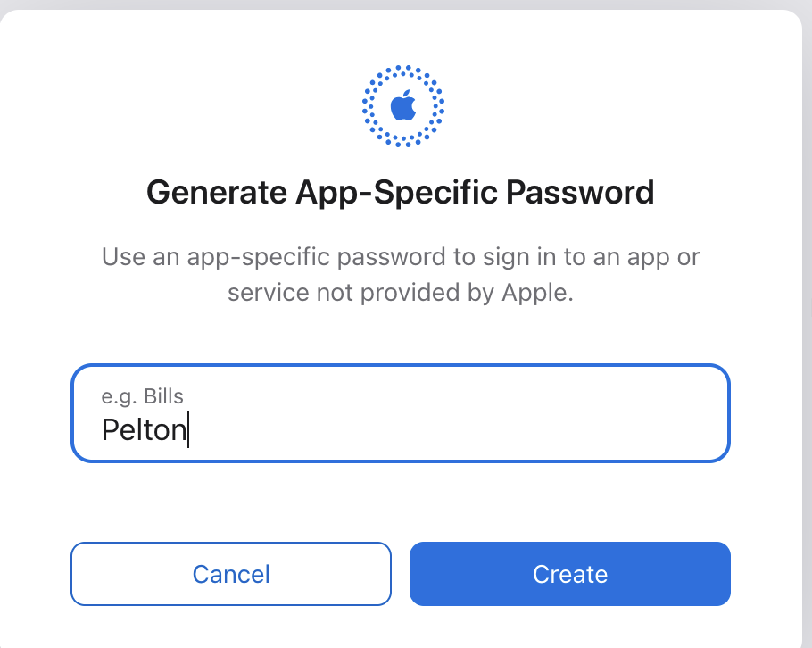
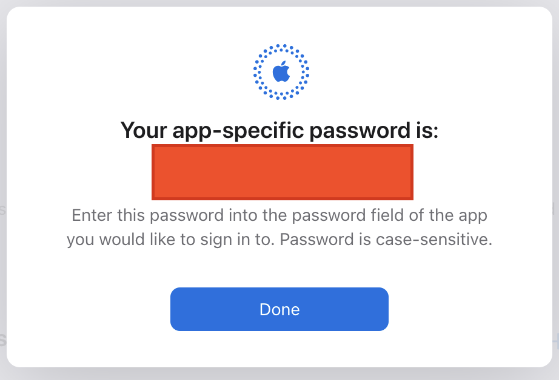

# iCloud

## Checklist

- [ ] Turn on two-factor authentication
- [ ] Create an app-specific password
- [ ] Add the account in Pelton

!!! warning "Two-factor authentication is required"
    Apple only lets you create app-specific passwords once two-factor
    authentication is turned on for your Apple ID. If you haven't enabled
    it yet, turn it on in your Apple ID settings first, you'll be asked to
    confirm sign-in on a trusted device or phone number in addition to your
    password from then on.

!!! warning "You must use an app-specific password, not your Apple ID password"
    Apple rejects your normal Apple ID password for IMAP/SMTP mail apps.
    Pelton's **Password** field needs an app-specific password instead,
    generated separately for Pelton.

- [x] Turn on two-factor authentication

## Adding the account

1. Open **Add mailbox**, choose **Add a mailbox**, then pick **iCloud**
   from the provider list. Fill in your **Email** and **From name**. Pelton
   already knows iCloud's IMAP/SMTP hosts, so you won't need to touch those.

    

2. Click **Create an app-specific password**. This opens
   [account.apple.com](https://account.apple.com/); sign in with your Apple
   ID if you aren't already.

3. Signing in lands you on **Sign-In & Security**. Scroll down and open
   **App-Specific Passwords**.

    

4. Click the **+** next to **Passwords**.

    

5. Type a name for it (for example "Pelton") and click **Create**.

    

6. Apple shows you the generated password. Copy it, this is what goes in
   Pelton's **Password** field, then click **Done**.

    

7. Back in Pelton, paste the app-specific password into the **Password**
   field, click **Test connection**, then **Add mailbox**.

- [x] Create an app-specific password
- [x] Add the account in Pelton

## Need help?

See [Support](../support.md).
