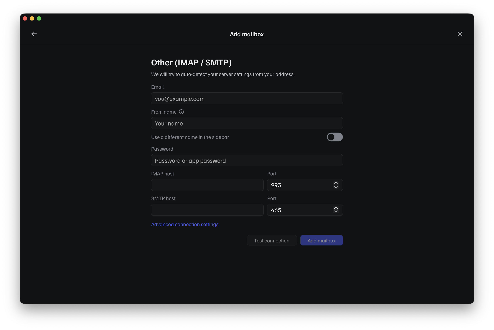
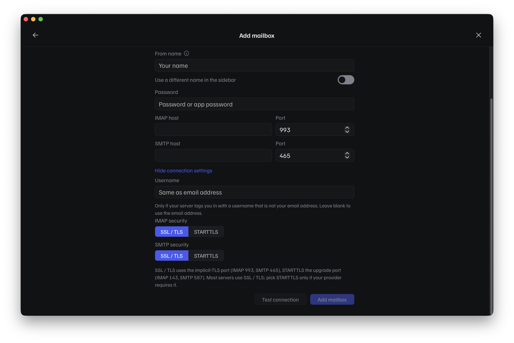
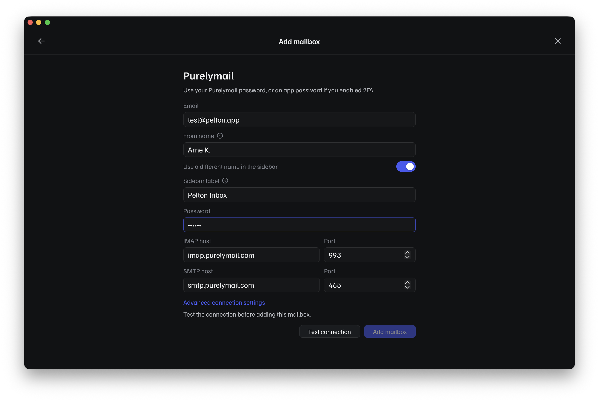

# Generic IMAP/SMTP

Use this if your provider isn't Gmail, iCloud, or Outlook, for example a
work/school account, a self-hosted mail server, or any other provider that
gives you IMAP and SMTP settings directly.

Yahoo, Fastmail, and Purelymail also use this same flow. Their tiles in the
provider picker aren't a separate integration, they just pre-fill the
IMAP/SMTP hostnames and ports for you so you don't have to look them up.
See [Provider presets](#provider-presets) below.

## Checklist

- [ ] Gather your server settings
- [ ] Add the account in Pelton
- [ ] Test sending and receiving

## Before you start

You'll need the following from your provider or IT department:

- Your email address and password (or an app-specific password, if your
  provider requires one for third-party mail clients)
- IMAP server hostname and port (commonly `993`)
- SMTP server hostname and port (commonly `465`, sometimes `587`)
- Whether IMAP/SMTP use SSL/TLS or STARTTLS

!!! tip "Where do I find my IMAP/SMTP hostnames?"
    Your provider's support site has the definitive answer. Search for
    "`<your provider>` IMAP settings", and look for a page aimed at setting
    up a third-party mail client (it's often filed under "desktop app" or
    "other mail app" setup, not the provider's own app). Work/school and
    self-hosted accounts usually get these settings from whoever
    administers the mail server instead.

!!! warning "No POP3 support"
    Pelton only supports IMAP, not POP3. If your provider's settings page
    gives you a choice, make sure you're looking at the IMAP settings.

- [x] Gather your server settings

## Adding the account

1. Open **Add mailbox** and choose **Add a mailbox**:

    

2. Pick **Other (IMAP / SMTP)** from the provider list:

    

3. Fill in your **Email**, **From name**, and **Password** (or app password).

    

    As soon as you type your email address, Pelton tries to guess your
    **IMAP host** and **SMTP host** from the domain. Treat this as a
    starting point, not a guarantee: the guess is based on common patterns
    (like `imap.example.com` for `you@example.com`), so it can easily be
    wrong for smaller or self-hosted providers. Check the guessed hostnames
    against what you gathered above, and correct them by hand if they
    don't match.

4. If your provider needs a non-default port, a STARTTLS connection, or a
   separate login username, expand **Advanced connection settings**:

    

    - **Username** only needs filling in if your server logs you in with
      something other than your email address. Leave it blank otherwise.
    - **IMAP/SMTP security**: SSL/TLS uses the implicit-TLS port (IMAP `993`,
      SMTP `465`); STARTTLS uses the upgrade port (IMAP `143`, SMTP `587`).
      Most providers use SSL/TLS, only switch to STARTTLS if yours requires it.

5. Click **Test connection**. Pelton needs a successful test before it lets
   you click **Add mailbox**, so if the button stays disabled, double-check
   the hostnames, ports, security setting, and password above.

- [x] Add the account in Pelton

## Provider presets

Purelymail, Fastmail, and Yahoo Mail each get their own tile in the provider
picker. They use the same IMAP/SMTP flow as above, but Pelton pre-fills the
host and port for you, so you only need to enter your email, name, and
password:

This example also shows **Use a different name in the sidebar**, which adds a
**Sidebar label** field, useful if you want to tell accounts apart in the
sidebar without changing what recipients see as your "from" name.

## Testing it

TODO: how to confirm it worked (e.g. send a test email to yourself, check
that existing mail syncs in).

- [x] Test sending and receiving

## Troubleshooting

??? question "Wrong port or encryption setting"
    SSL/TLS and STARTTLS use different ports (see
    [Adding the account](#adding-the-account) above): SSL/TLS is the
    implicit-TLS port (IMAP `993`, SMTP `465`), STARTTLS is the upgrade port
    (IMAP `143`, SMTP `587`). Mismatching them is the single most common
    cause of a failed test connection.

    The symptom is usually a timeout or a generic "couldn't connect" error
    rather than anything mentioning encryption, since the client and server
    are speaking past each other rather than actively refusing the
    connection. If your provider's documentation lists both a port and an
    encryption method, make sure the pair you entered in Pelton actually
    matches one of the pairs they list, don't mix a SSL/TLS port with
    STARTTLS or vice versa.

??? question "Your provider needs an app password"
    Once two-factor authentication is on, most providers stop accepting
    your normal account password for IMAP/SMTP and expect a separate,
    app-specific password instead. This is common with Gmail, Yahoo, and
    iCloud, and Pelton's dedicated flows for those handle it for you; for a
    generic IMAP/SMTP account you have to generate the app password
    yourself.

    Look in your provider's account security settings for something called
    "app passwords", "app-specific passwords", or "third-party app access".
    Generate one there and use it in Pelton's **Password** field instead of
    your normal login password.

??? question "Your provider blocks third-party mail apps"
    Some providers disable IMAP/SMTP access by default and require you to
    turn it on yourself in your account settings before any third-party
    client, Pelton included, can connect. A smaller number of free consumer
    providers don't allow third-party access at all, no matter what you
    enable.

    Check your provider's account settings, or search their support site
    for "IMAP access" or "third-party app access", to confirm it's actually
    turned on for your account before assuming the settings in Pelton are
    wrong.

??? question "A firewall or VPN is blocking the connection"
    Corporate networks and some VPNs block outbound IMAP/SMTP ports
    (`993`, `465`, `143`, `587`) as a matter of policy, which looks
    identical to a wrong host or port from inside Pelton: the test
    connection just times out. If you're on a work network, a school
    network, or a restrictive VPN, try again on a different network (or
    with the VPN off) before troubleshooting anything else. If it works
    elsewhere, the network was the problem, ask whoever manages it to allow
    the relevant ports.

Still stuck? See [Support](../support.md).

## Need help?

See [Support](../support.md).
