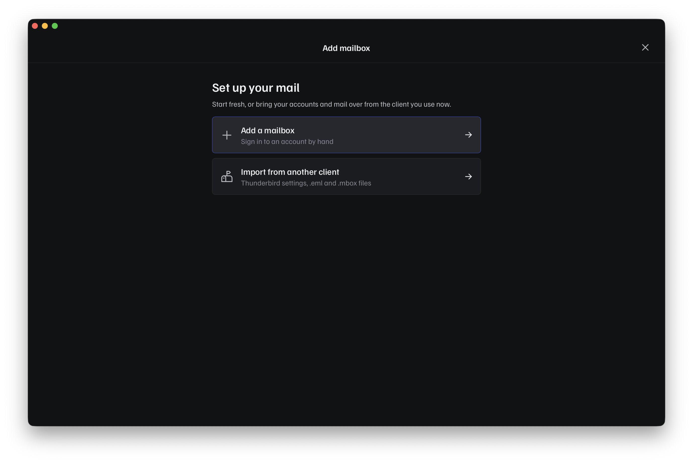
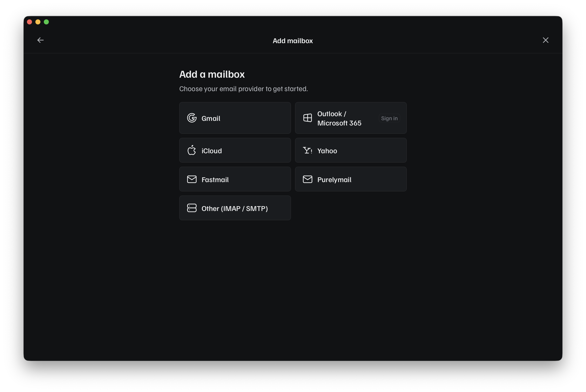

# Setting up a mailbox

To manage your mailboxes, open Settings
(++cmd+comma++++ctrl+comma++,
or **Pelton > Settings** from the menu bar) and go to **Accounts** in the sidebar. Accounts can
be edited, added, or removed there.

To add a mailbox faster, press
++cmd+m++++ctrl+m++
instead.

Adding a mailbox starts with a choice between setting up a fresh account or
importing one from another client:

Choosing **Add a mailbox** shows the provider picker:

Pick your provider:

-   __Gmail__

    ---

    [Set up Gmail &rarr;](gmail.md)

-   __iCloud__

    ---

    [Set up iCloud &rarr;](icloud.md)

-   __Outlook__

    ---

    [Set up Outlook &rarr;](outlook.md)

-   __Purelymail__

    ---

    [Set up Purelymail &rarr;](imap-smtp.md)

-   __Fastmail__

    ---

    [Set up Fastmail &rarr;](imap-smtp.md)

-   __Yahoo__

    ---

    [Set up Yahoo &rarr;](imap-smtp.md)

-   __Generic IMAP/SMTP__

    ---

    [Set up a generic account &rarr;](imap-smtp.md)

-   __Importing from Thunderbird__

    ---

    [Import from Thunderbird &rarr;](thunderbird-import.md)

??? question "Which one do I need?"
    - Using a `@gmail.com`, `@googlemail.com` or Google Workspace address? Use [Gmail](gmail.md).
    - Using an `@icloud.com`, `@me.com`, or `@mac.com` address? Use [iCloud](icloud.md).
    - Using an `@outlook.com`, `@hotmail.com`, or Microsoft 365 address? Use [Outlook](outlook.md).
    - Moving your accounts and mail over from Thunderbird? Use
      [Importing from Thunderbird](thunderbird-import.md).
    - Using Purelymail, Fastmail, or Yahoo Mail? Pick that provider's tile in the picker.
      Pelton pre-fills the IMAP/SMTP settings for you; see
      [Generic IMAP/SMTP](imap-smtp.md#provider-presets) for details.
    - Anything else, self-hosted, or a work server your IT team gave you settings for? Use
      [Generic IMAP/SMTP](imap-smtp.md).

## Need help?

See [Support](../support.md).
