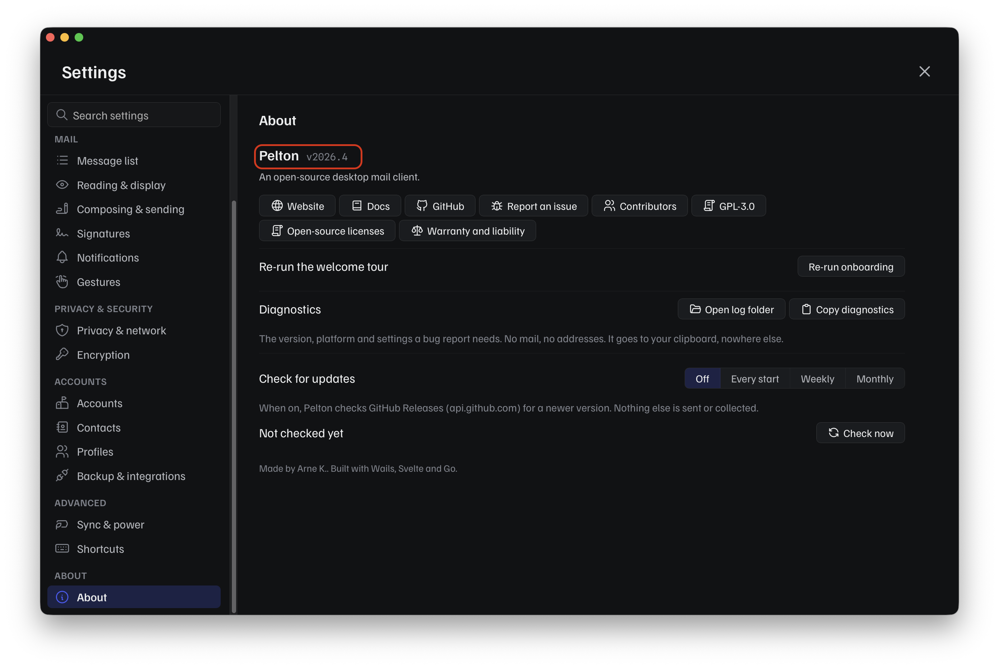
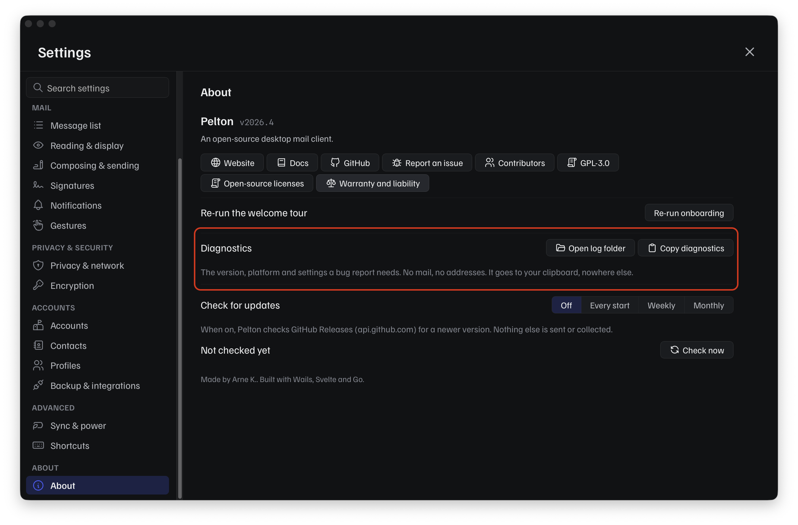
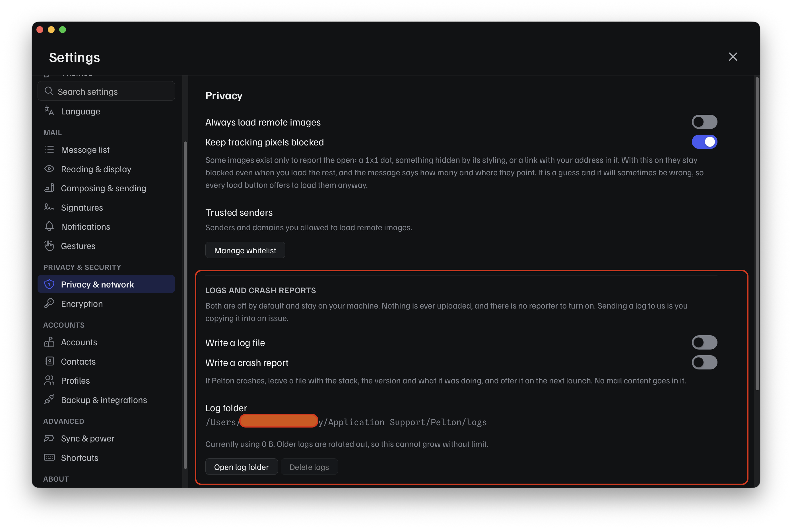

# Reporting an issue

Bugs, feature requests, packaging problems, and translation issues are all
tracked on [GitHub Issues](https://github.com/peltonapp/Pelton/issues). Open
a new one at
[github.com/peltonapp/Pelton/issues/new/choose](https://github.com/peltonapp/Pelton/issues/new/choose)
and pick the template that fits:

- **Bug report**, something isn't working as expected.
- **Feature request**, an idea or improvement Pelton doesn't support today.
- **Packaging / installation issue**, trouble installing, updating, or
  uninstalling Pelton (dnf, Copr, the Windows installer, the macOS `.dmg`,
  and so on).
- **Localization issue**, missing, incorrect, or untranslated text.

Picking a template keeps reports consistent and easier to act on.

!!! warning "Found a security vulnerability?"
    Don't open a public issue for it. See [Support](support.md#security-issues)
    for how to report it privately instead.

## Before you file a bug or packaging report

Both templates ask for your Pelton version, operating system, and how you
installed it. Settings > About has all of that, right next to **Report an
issue**:

{ width=450 }

Rather than copying each field by hand, use **Diagnostics**:

{ width=450 }

Click **Copy diagnostics** to copy your version, platform, and settings to
the clipboard, no mail, no addresses, nothing else, and paste it straight
into the issue.

If that isn't enough detail, Settings > Privacy & network has **Logs and
crash reports**, both off by default and never uploaded anywhere on their
own:

{ width=450 }

Turn on **Write a log file**, reproduce the problem, then use **Open log
folder** to find the log and attach it to your issue yourself, sending a
log to the team is you copying it in, Pelton never does this
automatically.

??? tip "Can't reach Settings? Use `--debug`"
    If Pelton crashes or won't get far enough to open Settings, launch it
    with the [`--debug`](cli-flags.md) flag instead. It forces file logging
    on at debug level regardless of what Settings say, so you still get a
    log to attach:

    ```bash
    pelton --debug
    ```

If the problem is about updating specifically, [Updating Pelton](updating.md)
might already cover it before you need to file anything.

## Need help?

See [Support](support.md).
