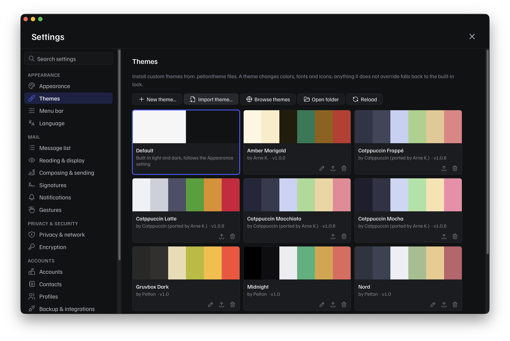

# Themes

A theme changes Pelton's colors, fonts, and icons, and can add its own CSS on top for anything else. It's a small, sandboxed package: no network access, no filesystem access beyond what's bundled inside the file itself.

## What a theme can and can't do

Every theme, whether installed from a file or built in Settings, is validated the same way before it's ever applied:

- **Token allowlist.** Only a fixed, documented set of tokens is themeable, see [Theme format](format.md#tokens).
- **No external requests.** A theme can't reach out to the internet, anything it needs (fonts, images) has to be bundled inside the file itself. If a theme tries to anyway, Pelton warns you and blocks it by default.
- **Safe icons.** A custom icon can't contain anything executable, only plain images survive.
- **Size caps.** A theme file can't be huge, see [Theme format](format.md#size-limits) for the exact limits, so it can't balloon Pelton's memory or disk usage.

## Next steps

-   __Installing a theme__

    ---

    Where to get one, how to import it, and where installed themes live
    on disk.

    [Install a theme →](install.md)

-   __Theme format__

    ---

    The full `manifest.json` schema, the complete token list, and the size
    limits.

    [Read the format reference →](format.md)

-   __Create a theme__

    ---

    A full walkthrough: writing a manifest, adding CSS and icons, testing
    it, and sharing it with the community.

    [Start creating →](create.md)

## Need help?

See [Support](../support.md).
