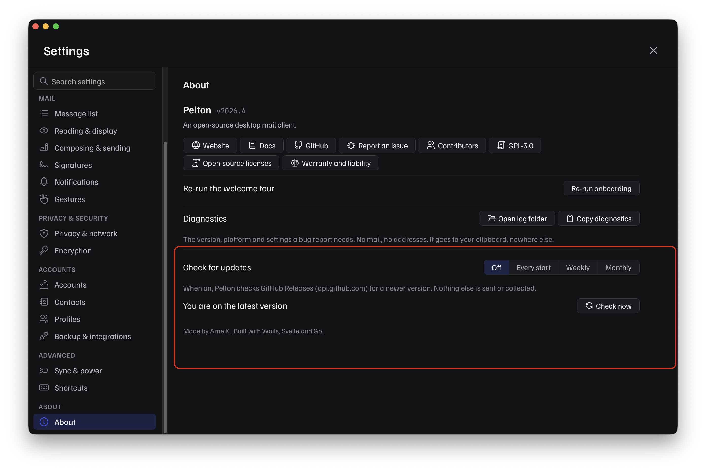

# Updating Pelton

Pelton doesn't auto-download or auto-install updates on any platform. It can
optionally check GitHub for a newer release and tell you about it, but
actually updating is always a manual step, and how you do it depends on how
you installed Pelton.

- [Checking for updates in-app](#checking-for-updates-in-app)
- [macOS](#macos)
- [Windows](#windows)
- [Fedora (Copr)](#fedora-copr)
- [Arch (AUR)](#arch-aur)
- [Debian/Ubuntu (.deb) and generic RPM](#debianubuntu-deb-and-generic-rpm)
- [Generic binary](#generic-binary)
- [Nix](#nix)

## Checking for updates in-app

Open Settings and go to **About**. There you can:

- Pick how often Pelton checks for a new release: **Off** (default),
  **Every start**, **Weekly**, or **Monthly**.
- Click **Check now** to check immediately.



Pelton only ever talks to GitHub Releases (`api.github.com`) for this, and
only when a check runs, nothing else is sent or collected. If a newer
release exists, Pelton shows a **View release** link to the release on
GitHub, that's it. It doesn't download or install anything for you; use the
platform instructions below to actually update.

## macOS

Download the newer `.dmg` from
[pelton.app/download](https://pelton.app/download) or
[GitHub Releases](https://github.com/peltonapp/Pelton/releases/latest) and
drag it over the existing app in Applications, the same as a first install.
See [Install on macOS](install/macos.md) for the full walkthrough, including
verifying the checksum and getting past Gatekeeper again.

## Windows

Download and run the newer installer from
[pelton.app/download](https://pelton.app/download) or
[GitHub Releases](https://github.com/peltonapp/Pelton/releases/latest). It
installs over the existing version. See
[Install on Windows](install/windows.md) for the full walkthrough.

## Fedora (Copr)

If you enabled the Copr repo, Pelton updates like any other package:

```bash
sudo dnf upgrade
```

!!! warning "This updates your whole system, not just Pelton"
    `sudo dnf upgrade` updates every package on your system. To update only
    Pelton and leave everything else alone, name it specifically:

    ```bash
    sudo dnf upgrade pelton
    ```

## Arch (AUR)

Update through your AUR helper as usual:

```bash
yay -Syu
```

!!! warning "This updates your whole system, not just Pelton"
    Like `dnf upgrade`, `yay -Syu` updates every package on your system. To
    update only `pelton-bin`, name it specifically instead:

    ```bash
    yay -S pelton-bin
    ```

`pelton-bin` on the AUR is maintained by a third party
([leeteral](https://leeism.com)), not built directly from Pelton's release
pipeline, so it can lag behind a brand new release while the package gets
bumped, usually by just a few hours. You can check its current status on
[Repology](https://repology.org/project/pelton/versions), which tracks
Pelton's packaging across distros and package managers.

## Debian/Ubuntu (.deb) and generic RPM

There's no repo to pull updates from. Download the newer `.deb` or `.rpm`
from [pelton.app/download](https://pelton.app/download) or
[GitHub Releases](https://github.com/peltonapp/Pelton/releases/latest),
verify its checksum, and install it the same way as the first time
(`dpkg -i` / `rpm -i`); it replaces the existing version. See
[Install on Linux](install/linux.md) for the full steps.

## Generic binary

Download the newer binary, verify its checksum, and replace the old one in
place (`chmod +x` it again if needed). See
[Install on Linux](install/linux.md#generic-binary) for the full steps.

## Nix

Re-run the same command you used to install, pointing at the new release
tag:

```bash
nix profile install github:peltonapp/Pelton/v2026.5
```

This replaces the previous profile entry. Don't point it at the bare repo
instead of a tag, that would track an unreleased, unpinned build rather than
a specific version.

## Need help?

See [Support](support.md).
